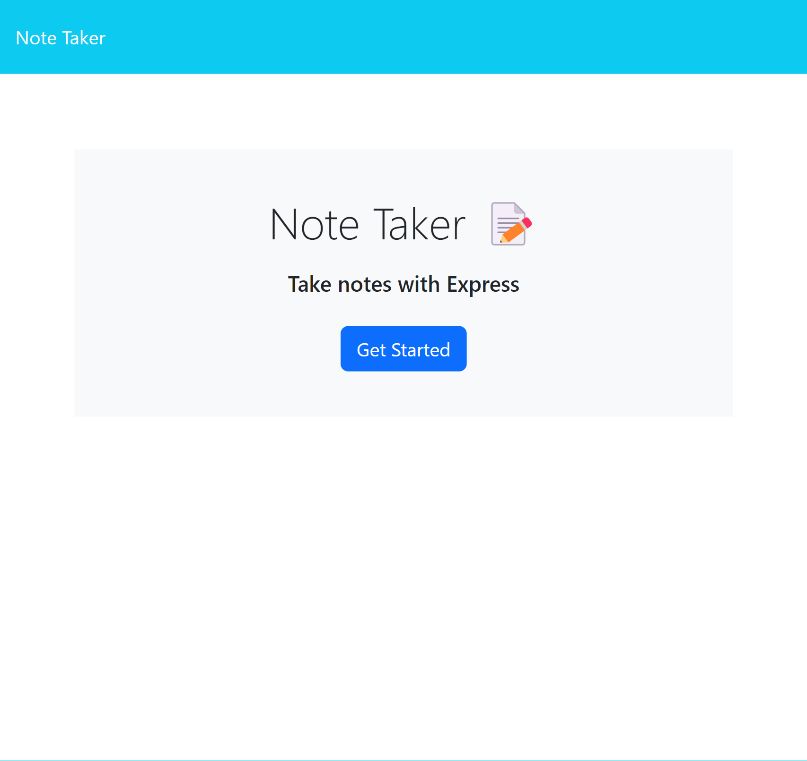
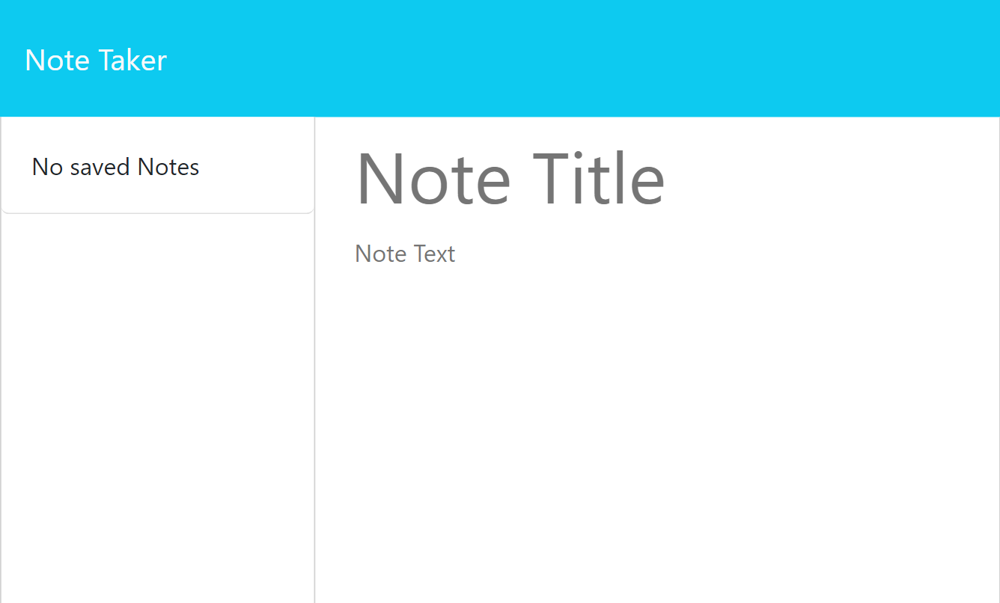
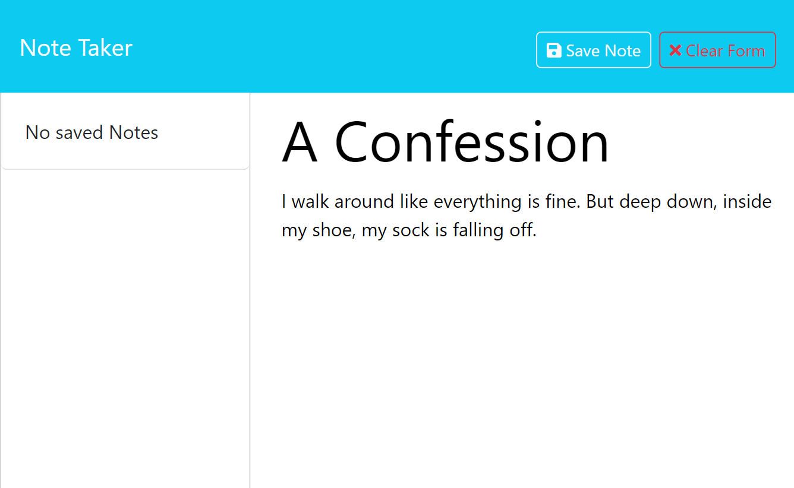
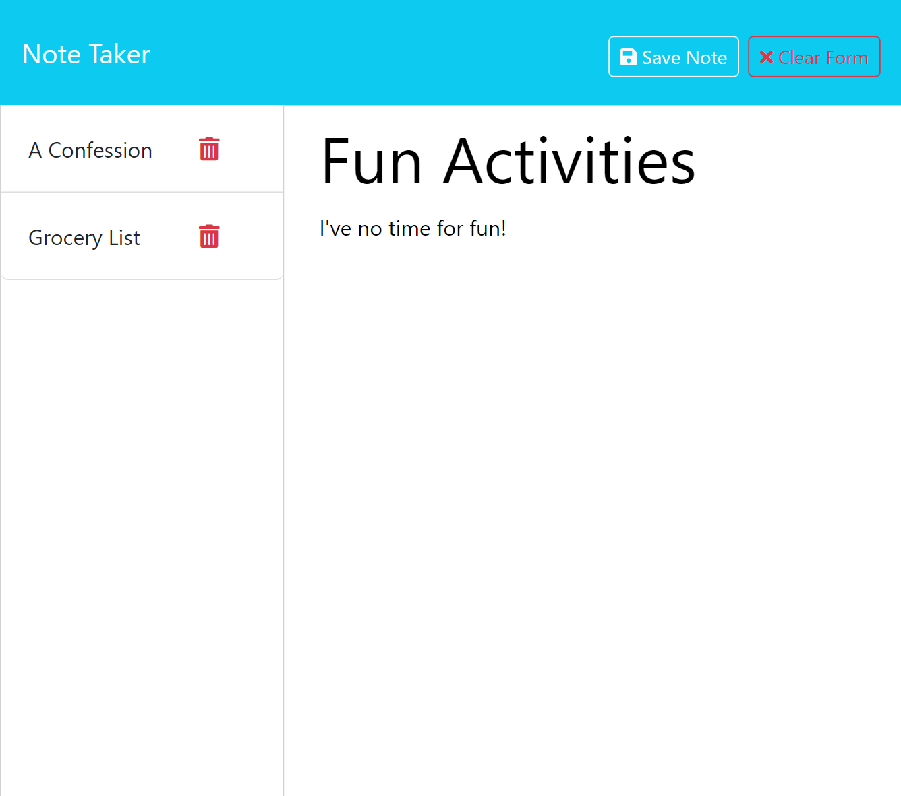

# Note_Taker_Erin_Mulcahey

## Description

The goal was to create an application called Note Taker that can be used to write and save notes. This application uses an Express.js back end, then saves and retreives note data from a JSON file. My motivation for creating this application was to give the user a way to easiy take and keep notes or reminders then read and or delete the notes at a later time. It can be helpful to some people if they have a way of keeping track of thoughts and a place to put all those thoughts. This application allows the user to choose their own note title then to type what ever they'd like to include within the body of the note. I learned how to build the back end, connect the back end to the front end, and then deploy an application to Render.

## Table of Contents (Optional)

## Installation

N/A

## Usage

Provide instructions and examples for use. Include screenshots as needed.

To add a screenshot, create an `assets/images` folder in your repository and upload your screenshot to it. Then, using the relative file path, add it to your README using the following syntax:

## Credits

N/A

## License

Please refer to the LICENSE in the repo.
